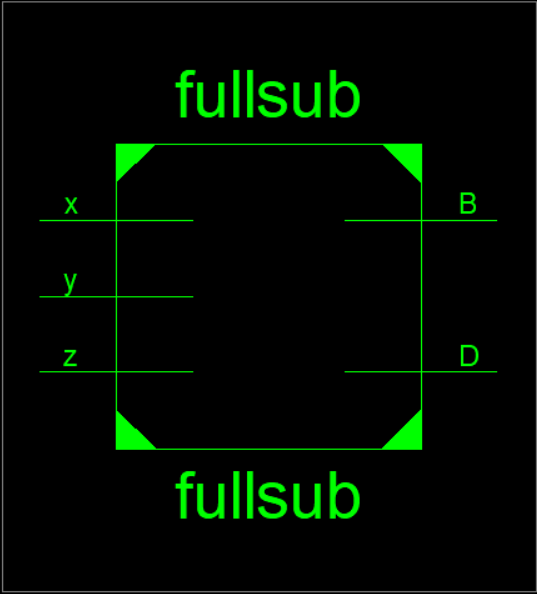
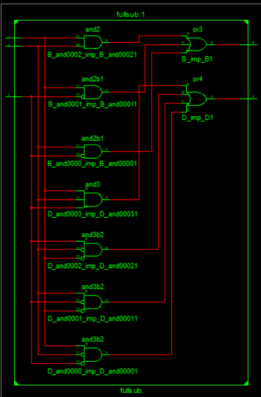
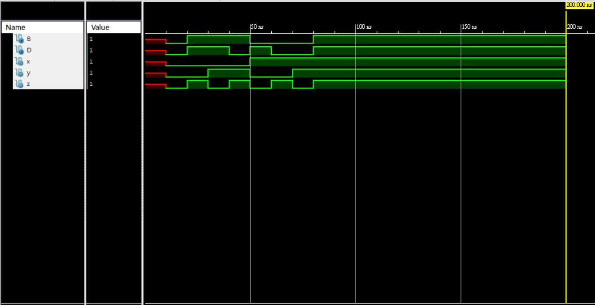
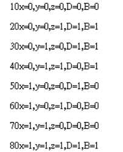
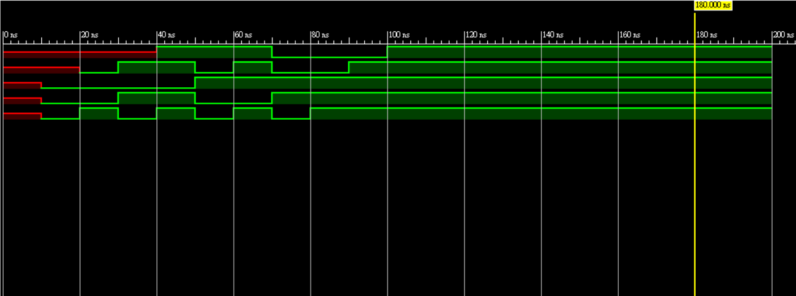
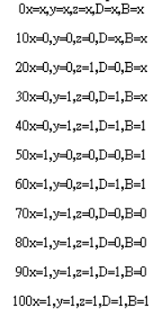

### 第一題
根據要求內容將全減器寫出，這次的寫法與前一個Lab 2不同。並非使用gate level寫法而是換使用assign這種寫法。

將[主程式](https://github.com/stormteeth/verilog-/blob/main/Lab%203/full%20subtractor.v)編譯後產生RTL電路圖。

最外層:

中間層:

可以看到內部邏輯閘與使用assign直接邏輯運算的內容是相同的。

模擬解果:

使用monitor後可檢查結果是否與全減器相符合。

### 第二題
根據第二題題意是要檢視在assign下是否與gate level一樣的延遲。但與Lab 2不同在Lab 2時我們是在邏輯閘階段就給予模擬延遲故其結果是會有邏輯閘等邏輯閘的情況發生。但在assign時是將其中邏輯閘所會產生的解果先算好再把結果延遲指定時間後輸出。

assign #10 D=(~x)&(~y)&(z)|(~x)&(y)&(~z)|(x)&(~y)&(~z)|(x)&(y)&(z);

assign #20 B=(~x)&(y)|(~x)&(z)|(y)&(z);

可以知道D與B都是有邏輯解果後等10ns與20ns才將結果輸出

模擬結果:

其monitor的結果可以與前一張做比較，加上延遲後導致結果錯位。可能有人發現為什麼B給的延遲明明是20ns但當在10ns給予輸入值時D正確的在20ns輸出結果但B卻又多延遲了10ns在40ns才輸出結果。這是因為對D來說我們給予輸入訊號與D的延遲不會導致D出現問題。就像前面提到的我們用assign時結果早就出來了只是根據使用者設定延遲，指定時間後輸出。但對B會有個嚴重的問題出現就是因為延遲是20ns但每10ns就有新的輸入導致B不在指定的20ns延遲輸出，至於為甚麼在40ns才恢復正常，本人認為是因為在第30ns與40ns時期輸出結果相同為1故暫存在B的值能夠正常輸出，但也可以看出若不延長各個輸入的間隔時間真值表就會是錯的。

