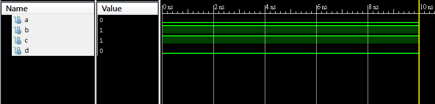
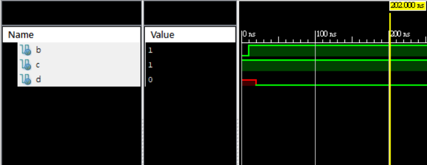
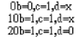

這次的Lab不需要打主程式都直接使用測試檔測試即可。
### [第一題](https://github.com/stormteeth/verilog-/blob/main/Lab%204/test_1.v)
可以看到這跟之前的Lab的測試檔沒什麼太大的區別，以一個initial begin和end為一個block依序執行程式內容。

可以看到d在a、b、c都有結果且經過指定的延遲後才正常輸出。

### [第二題](https://github.com/stormteeth/verilog-/blob/main/Lab%204/test_2.v)
這題的出現主要是要展示non-blocking這一概念，就之前我們寫測試程式時皆以blocking的方式撰寫。那這兩個寫法最大的不同就在於若以一個initial begin為一個block來看我們可以發現blocking的執行方式就是按照順序依序執行。那non-blocking呢就是一個block中的所有要求同時執行。

可以看到a、b、c與d都是在0ns的時候各自執行自己的任務

可以看到在第25ns時d便可以正確地顯示出結果，而且與第一題相比也少等了一半的時間。故適時的使用non-blocking是不錯的選擇。

### [第三題](https://github.com/stormteeth/verilog-/blob/main/Lab%204/text_3.v)
這題主要要看的是當兩個block同時執行時誰會先執行。可以看到如果用測試波型不太清楚。

結果用monitor也是在0ns時同時出現，可以知道對於initial begin這個層級來說都是同時執行的。

### [第四題](https://github.com/stormteeth/verilog-/blob/main/Lab%204/test_4.v)
第四題主要為驗證在第三題得到的結論

可以看到的確對initial begin一個大block來說兩個block是同時執行的

