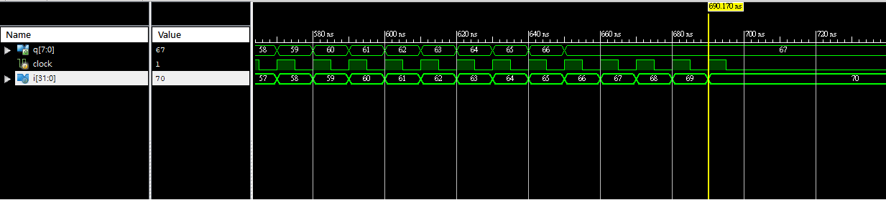
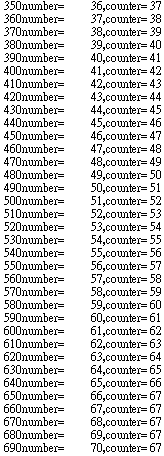

### [題目](https://github.com/stormteeth/verilog-#lab-5)
### 問題一
第一題的部分有用到一個新的概念，那便是我們所有的initial begin都可以指定一個編號。當我們的程式有需求時可以把指定的block開啟或結束。在這個例子裡我們可以看到在名為block1裡有clock在運作在此同時下方有個隨正緣時計數的值，名為number。可以看到當上方的block1因number的值計數到70時會把自己結束掉，也因為clock是寫在block1裡的故整個程式可以說是完全停擺了。

