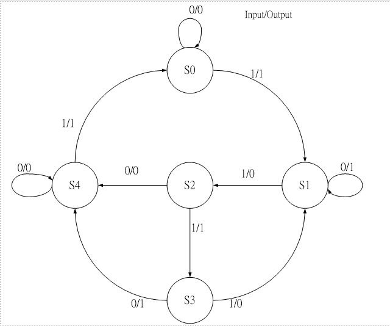
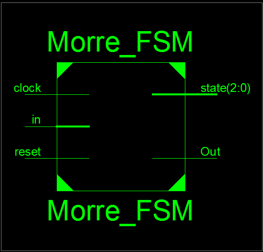
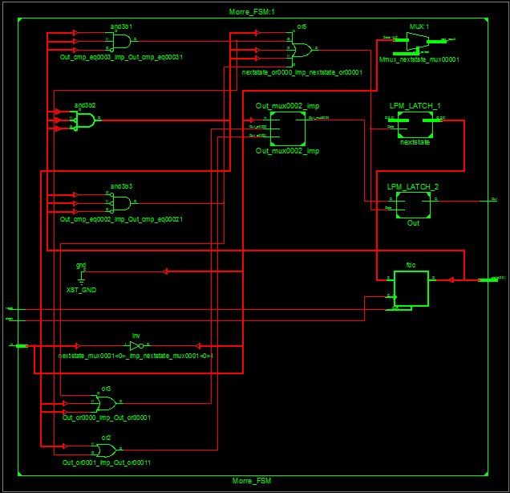
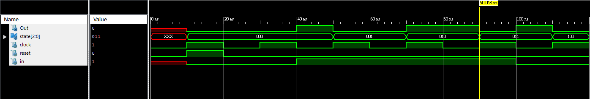
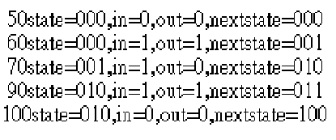

### [題目](https://github.com/stormteeth/verilog-#lab-6)

### 問題
這次的目的主要是寫有限狀態機，使用Moore機或Mealy機都可以。本人是使用Moore機的寫法。

將[主程式](https://github.com/stormteeth/verilog-/blob/main/Lab%206/FSM.v)拿去編譯產生RTL

最外層:



中間層:



根據題目要求我們需要從s0->s1->...到s4，故其模擬程式應照狀態機要求給予0或1。因初始設定起點為s0就其順序為1->1->1->0，便可完成題目要求。
```verilog
    #10 reset=1'b0;//S0
    #20 in=1'b1;//S1
    #20 in=1'b1;//S2
    #20 in=1'b1;//S3
    #20 in=1'b0;//S4
```
需要注意的點為clock的部分，像這題的週期為20。若我們給輸入的間隔太短可能導致無法照規定順序前進




