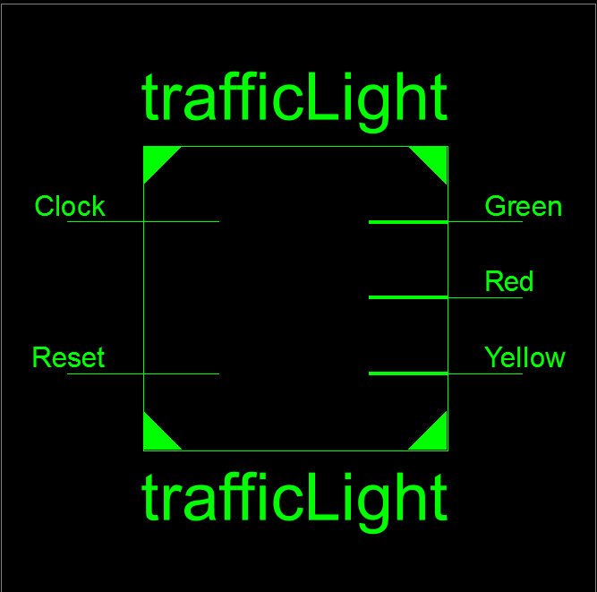
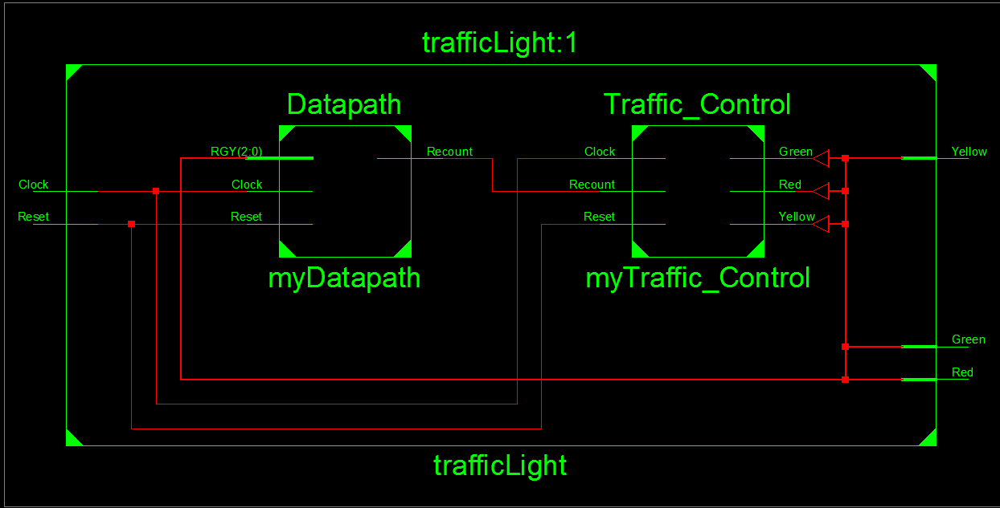
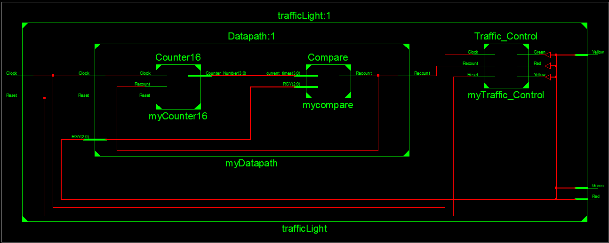
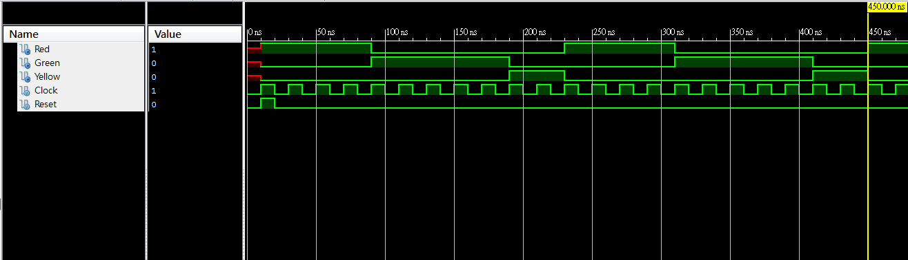
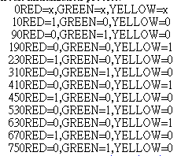

### [題目](https://github.com/stormteeth/verilog-#lab-7)
### 問題
根據上次Lab 6學的FSM，這次的Lab 7也用上了上次的觀念來撰寫但這次的主程式看起來比Lab 6複雜上許多，主要是為了新的呼叫副程式概念，不然其實只要在上次的Lab 6做些修改Lab 7的答案就出來了。那這次就依照RTL的階層來看這次的Lab 7。

最外層:



中間層:



從這邊我們就可以發現我們的主程式最主要的兩個block為Datapath和Traffic_Control。Traffic_Control的內容與上次Lab 6相似，跟以往不同的地方在於Datapath，可以看到這次呼叫副程式的方法跟之前不一樣。其邏輯為:

呼叫的副程式  自訂名稱(.自己block的名稱(呼叫的名稱));
```verilog
Datapath myDatapath(.Clock(Clock), .Reset(Reset), .RGY({Red, Green,Yellow}),
                    .Recount(Recount));
```
就以前我們只需要將要呼叫的參數依序填入即可，那用這種寫法最主要想做的就是RGY這個部分。可以看到在主程式Red、Green和Yellow只是一位元的參數但在Datapath裡是一個三位元的參數。那這種寫法呢就可以將三個一位元排成一個三位元的值。若用以前Lab的寫法就只能拆開並寫成能相對的值。我們可以以Traffic_Control為例。
### 這次的寫法
```verilog
Traffic_Control myTraffic_Control(.Clock(Clock), .Reset(Reset), .Recount(Recount),
                                  .Red(Red), .Green(Green), .Yellow(Yellow));
```
### 以前的寫法
```verilog
Traffic_Control myTraffic_Control(Clock,Reset,Recount,Red,Green,Yellow);
```
Datapath內部:
可以看到Datapath內部有兩個部分，分別為counter16和Compare。counter16就是很單純的4位元計數器forever loop的從0到15。那Compare的主要目的就是來判別我們的紅、黃和綠燈是否有走到我們所規定的時間，只要一到便清空計數以計算下個狀態所規定的時間。



經過測試波型後可以看到個燈號都有按照規定行進。




