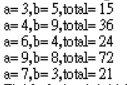
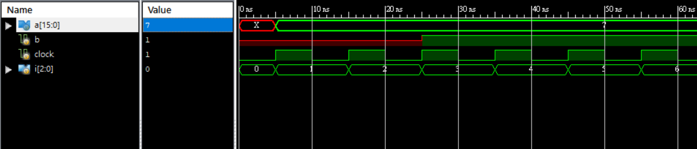
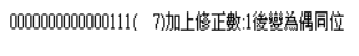

### [題目](https://github.com/stormteeth/verilog-#lab-8)
### 問題一
這題目雖然看起來只是單純的乘法，但其實以電腦的角度來看是只有加法的所以沒辦法直接使用運算符號直接求出結果，而是需要使用funtion這種屬於使用者自訂功能的寫法以達到乘法的功能。其邏輯為宣告一自訂位元大小的名稱然後根據使用者需求宣告輸入的位元數與名稱，之後在內部寫運算式。記得得打上endfuntion來將funtion的內容包起。
```verilog
function [7:0] multi_opter;
input [3:0]a;
input [3:0]b;
multi_opter = a * b;
endfunction
```

### 問題二
這題主要是要模擬電腦中檢查是否有位元錯誤的檢查方法，使用了最簡單的檢查方式:同位元檢查法。
```verilog
task separatly;
output b;
input [15:0]a;
integer c;
begin
   c=a[0]^a[1]^a[2]^a[3]^a[4]^a[5]^a[6]^a[7]^a[8]^a[9]^a[10]^a[11]^a[12]^a[13]^a[14]^a[15];
   if(c==0)
      b=0;
   else
      b=1;
end
endtask
```
那這裡又用到新的功能，名為task。基本上和funtion是相似的，那他們的差別又在哪呢。funtion最主要的功能在於輸入多個數值進行算數運算後只產生一結果值後輸出；task就比要偏向可以多個輸出只要將output設定好即可，而且task可以用上時間模擬，例如我們常用的always、posedge之類的。




