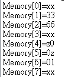
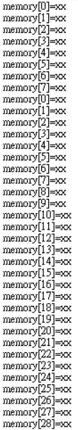
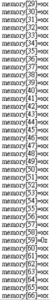
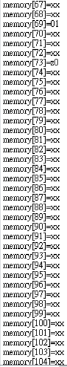
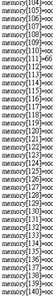
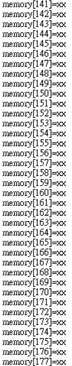
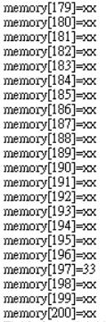

### [題目](https://github.com/stormteeth/verilog-#lab-9)
### 問題一
這題的重點在於讀取ini檔內的值放入我們所宣告的記憶體陣列中，對於我們的ini檔內容是這樣的
```verilog
@001 
33 66 
@004 
z0 0z 01 
```
其寫法為在@後指定儲存的位址空間(16進制)之後會一序讀值與放入，以上面來看就是從地址為001開始放33與66，33和66也可以寫成二進制0010_0001、0100_0010(underbar別忘了)。那至於下一次重@004開始，跳過的地方一律dont care。


### 問題二
將存在ini檔中的值讀取出來後暫存起來然後產生0~200的隨機亂數依序將33、66、z0、0z和01放入即可。



可以看到我重新於[197]放入33、[111]放入66、[197]放入33、[73]放入z0、[59]放入0z和[69]放入01。
